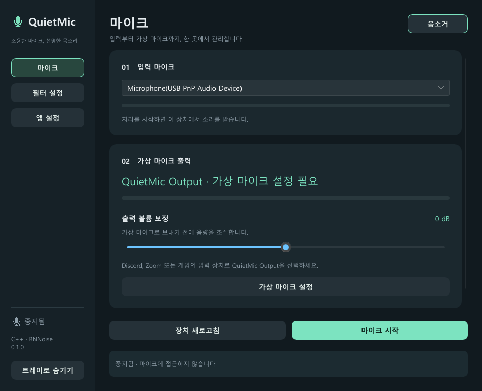
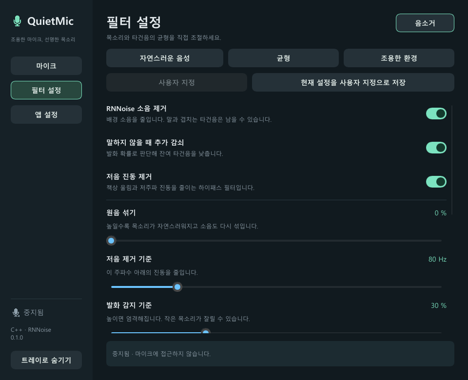
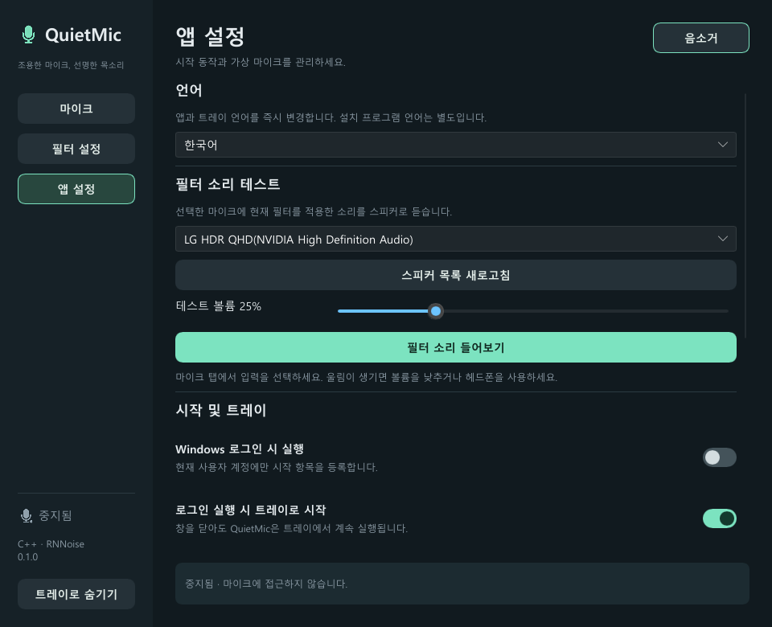

<p align="center">
  
</p>

<h1 align="center">QuietMic</h1>

<p align="center">
  키보드 타건음과 주변 소음을 줄여 주는 가벼운 Windows 가상 마이크
</p>

<p align="center">
  C++20 · Slint · RNNoise · Windows 11 x64
</p>

<p align="center">
  <a href="https://github.com/evilack/QuietMic/actions/workflows/build.yml"></a>
</p>

QuietMic은 실제 마이크의 소리를 실시간으로 처리해 **QuietMic Output**이라는 가상 마이크로 전달합니다. Equalizer APO와 VB-CABLE은 필요하지 않으며, 오디오는 PC 밖으로 전송하거나 저장하지 않습니다.

## 다운로드

설치용 빌드는 [GitHub Releases](https://github.com/evilack/QuietMic/releases)에서 받을 수 있습니다.
`QuietMic-Setup.exe`를 내려받고 함께 제공되는 `SHA256SUMS.txt`로 파일을 확인한 뒤 설치하세요.

## 화면

### 마이크

실제 입력 장치, QuietMic Output 상태, 출력 볼륨과 처리 상태를 한 화면에서 관리합니다.



### 필터 설정

RNNoise, 저음 제거, 발화 감쇠와 세부 값을 조절하고 사용자 지정 프리셋을 저장할 수 있습니다.



### 앱 설정

필터 결과 듣기, 언어, 로그인 실행과 가상 마이크 설정을 관리합니다.



## 주요 기능

- RNNoise 기반 실시간 소음 제거
- 키보드 저주파 진동을 줄이는 하이패스 필터
- 말하지 않을 때 잔여 소음을 낮추는 발화 감쇠
- 자연스러운 음성, 균형, 조용한 환경 프리셋
- 현재 필터 값을 보관하는 사용자 지정 프리셋
- 출력 볼륨 보정 `-15 dB`부터 `+15 dB`
- 필터링된 소리를 스피커로 확인하는 미리듣기
- 트레이 실행, 음소거, 처리 시작과 볼륨 설정
- 물리 마이크 분리 후 같은 장치가 돌아오면 자동 재연결
- 영어 기본값과 한국어를 포함한 8개 언어

지원 언어: English, 한국어, 日本語, 简体中文, 繁體中文, Español, Français, Deutsch

## 시스템 요구 사항

- Windows 11 x64
- 48 kHz 입력을 지원하는 마이크
- 설치와 가상 장치 준비를 위한 관리자 권한

## 설치

1. `QuietMic-Setup.exe`를 실행합니다.
2. 설치 프로그램 언어를 선택합니다.
3. 설치가 끝나면 QuietMic을 실행합니다.
4. **마이크** 화면에서 실제 입력 장치를 선택합니다.
5. 가상 마이크 준비가 필요하면 **가상 마이크 설정**을 누릅니다.
6. **마이크 시작**을 누릅니다.
7. Discord, Zoom, 게임 등의 입력 장치에서 **QuietMic Output**을 선택합니다.

설치 파일 자체는 Authenticode 무서명이므로 Windows SmartScreen 안내가 표시될 수 있습니다. 포함된 USB/IP 커널 드라이버 패키지는 Microsoft 서명본입니다.

## 사용자 지정 프리셋

1. **필터 설정**에서 원하는 스위치와 슬라이더를 조절합니다.
2. **현재 설정을 사용자 지정으로 저장**을 누릅니다.
3. 이후 **사용자 지정**을 누르면 저장한 필터 값이 복원됩니다.

사용자 지정 프리셋은 앱을 다시 실행해도 유지됩니다. 마이크 선택, 음소거, 출력 볼륨은 프리셋에 포함되지 않습니다.

## 필터 소리 테스트

1. **앱 설정**에서 스피커를 선택합니다.
2. 필요하면 **스피커 목록 새로고침**을 누릅니다.
3. **필터 소리 들어보기**를 누릅니다.

헤드폰이나 이어폰을 사용하면 마이크와 스피커 사이의 하울링을 막을 수 있습니다. 일반 마이크 처리가 실행 중이면 먼저 중지해야 합니다.

## 트레이 사용

창의 닫기 버튼은 QuietMic을 트레이로 숨깁니다. 트레이 아이콘의 메뉴에서 창 열기, 음소거, 마이크 시작과 중지, RNNoise, 로그인 실행, 출력 볼륨과 종료를 선택할 수 있습니다.

## 설정 저장 위치

설정은 현재 Windows 사용자 계정의 다음 파일에 저장됩니다.

```text
%LOCALAPPDATA%\QuietMic\settings.ini
```

오디오 녹음 파일은 생성하지 않습니다.

## 제거

Windows **설정 → 앱 → 설치된 앱 → QuietMic → 제거**를 선택합니다. 제거 프로그램은 실행 중인 QuietMic을 먼저 확인하고, QuietMic 파일과 가상 오디오 전송 구성요소를 정리합니다. Windows가 사용 중인 파일을 바로 제거할 수 없으면 재부팅이 필요할 수 있습니다.

## 소스에서 빌드

Visual Studio 2022 이상에서 **Desktop development with C++**와 **CMake tools for Windows**를 설치한 뒤 다음 명령을 실행합니다.

```powershell
git clone https://github.com/evilack/QuietMic.git
cd QuietMic
powershell -ExecutionPolicy Bypass -File .\scripts\bootstrap.ps1
```

`bootstrap.ps1`은 검증된 Slint C++ SDK 1.18.0과 NSIS 3.12를 프로젝트의 `.deps` 폴더에 준비하고 `QuietMic.slnx`를 생성합니다. 시스템 전체에 별도 SDK를 설치하지 않습니다. 이후 Visual Studio에서 `QuietMic.slnx`를 열어 `Release | x64`로 빌드할 수 있습니다.

설치 파일까지 명령줄에서 만들려면 다음 명령을 실행합니다.

```powershell
.\scripts\build.ps1 -SlintSdk .\.deps\slint
.\scripts\build-installer.ps1
```

GitHub Actions도 같은 스크립트를 사용하며 생성된 `QuietMic-Setup.exe`와 `SHA256SUMS.txt`를 빌드 아티팩트로 제공합니다.

## 라이선스

QuietMic에 포함된 RNNoise, Slint, usbip-win2 및 관련 구성요소의 고지는 [THIRD_PARTY_NOTICES.md](THIRD_PARTY_NOTICES.md)와 `licenses` 폴더에서 확인할 수 있습니다.
